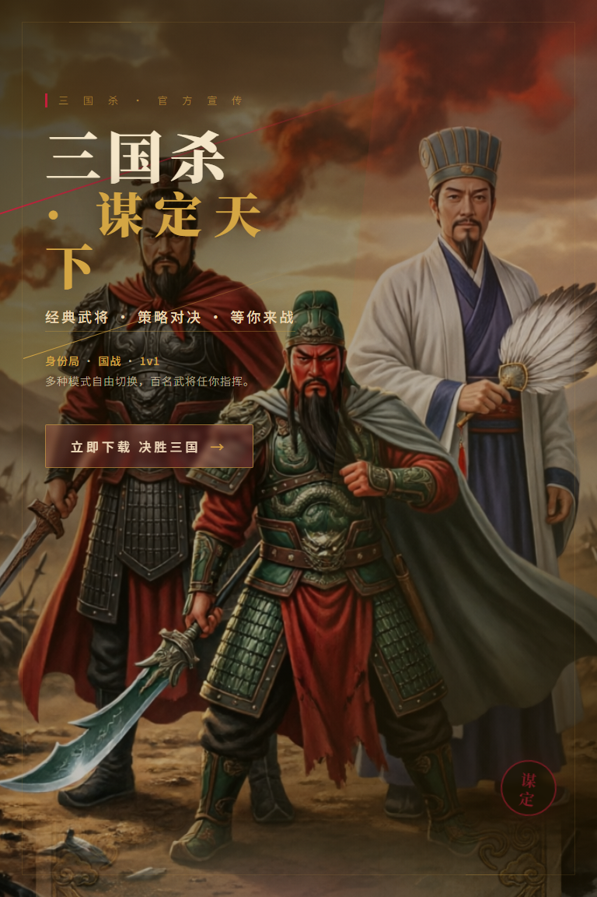

# PostAI: A Multi-Agent System for Poster Generation

## Abstract

This report presents **PostAI**, a multi-agent intelligent poster generation system that converts a natural-language request into an editable HTML/CSS poster and a rendered PNG image. The project code is available at <https://github.com/toaj111/PostAI.git>. Unlike direct text-to-image generation systems that ask a single model to produce an image in one step, PostAI decomposes poster creation into content planning, art direction, optional illustration generation, layout synthesis, browser-based rendering, visual critique, and iterative revision. The implemented backend is built with FastAPI, Pydantic, OpenAI-compatible model clients, Playwright, and a deterministic fallback path. The core pipeline maintains a typed graph state, exposes both synchronous and Server-Sent Events APIs, saves generated HTML/PNG assets, and can use a vision-language critic to score the rendered poster before routing the next iteration.

## 1. Introduction

Poster design is a multimodal task. A good poster must preserve the user's message, choose an appropriate visual language, arrange text and imagery with clear hierarchy, and satisfy practical constraints such as canvas size, readability, and export format. A single end-to-end image generator can produce attractive pictures, but it often gives limited control over text, layout structure, later editing, and iterative quality checking.

PostAI addresses this problem by treating poster generation as an agentic design workflow. The system does not only "draw a picture." It first builds a structured brief, then creates a visual direction, then asks a layout agent to produce a complete HTML/CSS document. This HTML is rendered by a headless browser into a PNG image, after which a vision-language critic evaluates the visual result and decides whether the system should stop or revise content, style, or layout.

The main contributions of the project are:

1. A typed multi-agent poster pipeline centered on `GraphState`.
2. A design-aware intermediate representation, including `PosterBriefV2`, `ArtDirectionV2`, and `CritiqueResult`.
3. A layout strategy that uses self-contained HTML/CSS instead of a limited geometric primitive schema.
4. Browser-based rendering with Playwright, which allows realistic CSS typography, gradients, textures, clipping, and image layers.
5. A VLM-based iterative critique loop with deterministic fallback behavior when remote models are unavailable.
6. A usable FastAPI backend and frontend demo for synchronous generation, streaming generation, reference images, generated illustrations, and HTML refinement.

## 2. Related Work

PostAI is related to language-agent research, iterative self-improvement, vision-language models, and browser-based visual rendering.

**Reasoning and acting agents.** ReAct introduced the idea of interleaving reasoning traces and task-specific actions so that language models can plan, act, observe, and update their behavior in an external environment. PostAI follows a similar high-level philosophy, but its environment is a poster production pipeline: agents read structured state, call model or rendering tools, observe a rendered poster, and decide the next action.

**Iterative refinement.** Self-Refine improves model outputs by generating feedback and then refining the previous output without model fine-tuning. Reflexion similarly uses verbal feedback signals as memory for later trials. PostAI adopts this iterative pattern in a visual design setting. The `VLMCritic` converts a rendered PNG into structured feedback, while the router injects that feedback into later layout/style/content steps.

**Vision-language critique.** Vision-language models can analyze image inputs together with text instructions. GPT-4V's system card describes multimodal LLMs as systems that expand language-only interfaces through image understanding. Qwen-VL is a large vision-language model family designed for image and text understanding, grounding, and text-reading tasks [1]. PostAI uses this class of models as a poster critic rather than as the primary generator.

**Image generation and visual assets.** Text-to-image work such as DALL-E 3 shows the value of detailed language supervision for image generation. PostAI can optionally call an image-generation provider through `IllustrationAgent`, but it treats generated images as assets to be composed into an HTML poster rather than as the entire final output.

**Structured validation and rendering.** Pydantic provides JSON Schema generation and validation from typed models, which PostAI uses to constrain agent outputs and API contracts. Playwright supports screenshot capture from web pages, which makes HTML/CSS a practical intermediate format for poster rendering.

## 3. Method

### 3.1 System Overview

The implemented backend is organized under `backend/app/` and exposes the generation service through FastAPI routes in `backend/app/api/routes_generate.py`. A request is first converted into a `GraphState`, which stores the user prompt, canvas size, generated content, style information, HTML layout, render result, critique history, iteration count, warnings, reference images, and generated illustration assets.

The main pipeline is implemented in `GraphRunner`:

```text
GenerateRequest
  -> ContentExtractor
  -> IllustrationAgent
  -> StyleDirector
  -> SpatialLayoutPlanner
  -> HTMLPainter
  -> VLMCritic
  -> Router
       -> final output, or
       -> another content/style/layout iteration
```

This design makes the system modular. Each stage has a narrow responsibility, and the graph state carries the shared context. If a remote LLM, VLM, or image-generation provider is not configured, the system can use local rule-based fallbacks, allowing the demo and tests to run without API keys.

### 3.2 Content Planning

The `ContentExtractor` reads the user prompt and produces a poster brief. The newer representation is `PosterBriefV2`, which contains:

- `PosterIntent`: poster type, communication mode, primary goal, audience, and tone.
- `ContentStrategy`: headline policy, information density, CTA policy, image policy, and inference policy.
- `PosterMessage`: text units such as headline, subhead, metadata, venue, date, price, or CTA.
- `VisualSubject`: visual subjects such as illustration, symbol, texture, pattern, shape, or photo.
- `must_not_do`: constraints such as not inventing exact dates or venues.

For compatibility with older downstream code, the brief is converted to `ContentPlan`. This compatibility layer is important because it allows the project to evolve without breaking the entire pipeline.

### 3.3 Style and Art Direction

The `StyleDirector` produces `ArtDirectionV2`, then converts it to the older `StyleGuide` interface. The richer art direction contains:

- poster language, such as Swiss grid, diagonal energy, editorial spread, typographic, cinematic, brutalist, minimal, ornamental, or custom composition;
- color system, including background, foreground, accent, and secondary colors;
- typography, including headline style, body style, scale contrast, and letter case;
- imagery strategy, including treatment, background strategy, prompt, and negative prompt.

The fallback implementation uses poster type and prompt keywords to choose stable design templates. For example, recruitment prompts use friendly campus-oriented styles, product prompts use premium neutral palettes, and music prompts use energetic stage-like directions.

### 3.4 Optional Illustration Generation

The `IllustrationAgent` selects suitable `VisualSubject` items and calls an OpenAI-compatible image-generation API when configured. The generated image is saved through `AssetStore` and exposed as a URL under `/assets/generated_illustrations/...`.

The agent is intentionally non-blocking. If image generation is disabled, not configured, or fails, the poster generation pipeline continues. This is a practical design choice because poster layout, typography, and fallback abstract graphics can still produce a useful result.

### 3.5 HTML/CSS Layout Planning

The `SpatialLayoutPlanner` is the main production artist. Instead of emitting a custom layout tree that would later be translated into graphics primitives, it emits a complete self-contained HTML document. This gives the model access to normal CSS concepts such as absolute positioning, grids, gradients, blend modes, masks, shadows, textures, inline SVG, and image cropping.

The layout prompt includes:

- user prompt and canvas size;
- `PosterBriefV2`;
- `ArtDirectionV2`;
- required/recommended/optional/omit element rules;
- reference images;
- generated illustration assets;
- VLM feedback from previous iterations.

The planner validates that the returned content looks like HTML and strips markdown fences if needed. When a real asset is required but omitted by the model, the planner can inject a fallback asset layer and record a warning.

### 3.6 Browser-Based Rendering

`HTMLPainter` renders the HTML poster with Playwright in headless Chromium and captures a PNG screenshot. The renderer uses `page.set_content(...)` and `page.screenshot(...)`, then returns a base64 PNG in `RenderResult`.

A key engineering detail is the canvas guard. LLM-generated HTML sometimes includes responsive rules or viewport scaling that can shrink the poster during screenshot capture. `apply_canvas_guard` appends CSS that fixes `html` and `body` to the requested width and height, disables page transforms, and enforces `overflow: hidden`.

The asset resolver also rewrites local `/assets/...` URLs into data URLs during rendering. This allows a saved HTML file to keep public asset paths while the Playwright render copy can load the images without requiring an HTTP origin.

### 3.7 Vision-Language Critique and Routing

`HeuristicVLMCritic` has two modes:

1. Vision model mode: sends the rendered poster image, layout HTML snippet, poster brief, and art direction to a vision-capable LLM.
2. Heuristic mode: checks HTML structure, missing required text, and signs of visually underdeveloped poster templates.

The target output is `CritiqueResult`, which contains:

- `score` from 0 to 100;
- `passed`;
- `vision_description`;
- `reasoning`;
- legacy `issues` and `suggestions`;
- structured issues with type, severity, target element, description, and suggestion;
- rubric fields for poster identity, topic fit, composition, typography, readability, and craft;
- `revision_focus`, one of `final`, `layout`, `style`, `content`, or `render`.

The router uses `revision_focus`, score, `target_score`, `min_iterations`, `max_iterations`, and score stagnation to decide whether to finalize or revise. This makes the loop more robust than simply parsing natural-language suggestions.

### 3.8 APIs and User Interface

The backend supports:

- `POST /api/v1/generate` for synchronous generation;
- `POST /api/v1/generate/stream` for Server-Sent Events progress;
- `POST /api/v1/reference-images/upload` for local reference images;
- `POST /api/v1/refine` for incremental HTML refinement;
- `GET /health`;
- `GET /assets/{filename}` for generated artifacts.

The frontend in `frontend/` provides a browser demo with prompt input, canvas size, iteration controls, target score, reference-image controls, generated-illustration controls, streaming logs, preview display, and refinement controls.

## 4. Experimental Results

### 4.1 Evaluation Setup

The repository is designed to be evaluated in two ways:

1. **Automated tests.** The `backend/tests/` directory contains tests for API routes, schema behavior, state-machine execution, HTML rendering, routing decisions, LLM/VLM clients, image client parsing, illustration handling, asset persistence, prompt baselines, golden prompts, and refinement.
2. **Generated artifacts.** The `generated/` directory contains saved HTML and PNG outputs from actual poster generation runs.

The default runtime supports both remote-model and fallback experiments. With API keys configured, the text LLM can generate structured briefs, style directions, and HTML, the image model can create illustration assets, and the VLM can critique the rendered image. Without API keys, local deterministic fallbacks still exercise the full pipeline.

### 4.2 Functional Coverage

The current tests cover the core risk areas of the system:

- `test_api_routes.py` checks synchronous generation, streaming generation, reference images, generated-illustration controls, invalid reference URLs, and API error behavior.
- `test_state_machine.py` checks that the full fallback graph produces a final image, image URL, score, and HTML layout.
- `test_html_painter.py` checks fallback HTML templates, canvas guard injection, local asset URL resolution, PNG rendering, output dimensions, and render errors.
- `test_router.py` checks score thresholds, minimum iterations, maximum iterations, score stagnation, and routing by `revision_focus`.
- `test_golden_prompts.py` checks several poster types, including minimal art exhibition, typographic jazz poster, recruitment poster, dense lecture schedule, abstract summer poster, product launch poster, and music festival poster.
- `test_illustration_agent.py`, `test_image_client.py`, and `test_asset_store.py` check image-asset creation, failure handling, URL/base64 parsing, and persistence.
- `test_llm_agents.py`, `test_llm_client.py`, `test_vision_client.py`, and `test_vlm_critic.py` check structured model clients, fallback behavior, prompt content, VLM parsing, and heuristic critique.

### 4.3 Generated Poster Example

The repository contains a newer generated two-iteration sample:

- `docs/examples/a26a379aef2e4af5bdf2a20f46a230c9_0.html`
- `docs/examples/a26a379aef2e4af5bdf2a20f46a230c9_0.png`
- `docs/examples/a26a379aef2e4af5bdf2a20f46a230c9_1.html`
- `docs/examples/a26a379aef2e4af5bdf2a20f46a230c9_1.png`

The second HTML file is a "San Guo Sha: Mou Ding Tian Xia" game-promotion poster. It demonstrates several system capabilities:

- fixed 768 by 1152 px poster canvas;
- full-bleed generated key visual, dark overlay gradient, flame glow, diagonal accent strip, red/gold accent lines, texture overlay, circular seal mark, and corner frame;
- integration of multiple generated illustration assets through `/assets/generated_illustrations/...`, including the main character visual and decorative bottom pattern;
- stable semantic IDs such as `key-visual`, `headline`, `subhead`, `body`, `cta`, `decorative-pattern`, and `seal-mark`;
- readable poster typography over a complex illustration background;
- canvas guard CSS persisted in the generated HTML.



### 4.4 Qualitative Analysis

The sample output shows that representing a poster as HTML/CSS is effective for the target problem. The layout includes real typography, compositional layers, public asset URLs, and a final PNG export. The system also preserves an editable source document, which is useful for refinement and debugging.

The project improves over a single-shot generation approach in three ways. First, content and style are explicit, so the system can avoid forcing unnecessary CTA buttons, subtitles, or images. Second, rendering is deterministic once the HTML is produced, which makes it easier to inspect and fix visual failures. Third, the VLM critique and router create a feedback loop, so the system can revise based on the rendered image rather than relying only on the initial prompt.

The main limitations are also clear. The visual quality depends on the LLM's ability to write strong HTML/CSS and the VLM's ability to judge poster design. The fallback templates are useful for robustness but cannot match a strong model-generated layout for all prompts. Text rendering depends on available fonts, and remote image/reference assets can introduce loading or style consistency issues. Finally, visual evaluation is currently mostly rubric-based and qualitative; a future benchmark should include human preference ratings, OCR/readability scores, and visual regression comparisons.

## 5. Conclusion

PostAI implements a practical multi-agent system for intelligent poster generation. Its key idea is to separate poster creation into interpretable stages: content strategy, art direction, optional illustration generation, HTML/CSS layout, browser rendering, visual critique, and iterative routing. This decomposition gives the system stronger controllability and observability than a single direct image-generation call.

The current implementation already supports synchronous and streaming APIs, generated assets, saved HTML/PNG outputs, reference images, refinement, schema validation, and fallback operation without model keys. The generated sample demonstrates that the system can produce a layered, editable, rendered poster. Future work should focus on stronger visual benchmarks, human evaluation, OCR-based readability checks, richer asset management, and more reliable learned refinement policies.

## Code Availability

The project code is publicly available at:

<https://github.com/toaj111/PostAI.git>

The local implementation discussed in this report corresponds to the repository structure under `backend/`, `frontend/`, and `docs/examples`.

## References

[1] Bai, J., Bai, S., Yang, S., Wang, S., Tan, S., Wang, P., Lin, J., Zhou, C., and Zhou, J. "Qwen-VL: A Versatile Vision-Language Model for Understanding, Localization, Text Reading, and Beyond." arXiv:2308.12966. <https://arxiv.org/abs/2308.12966>
