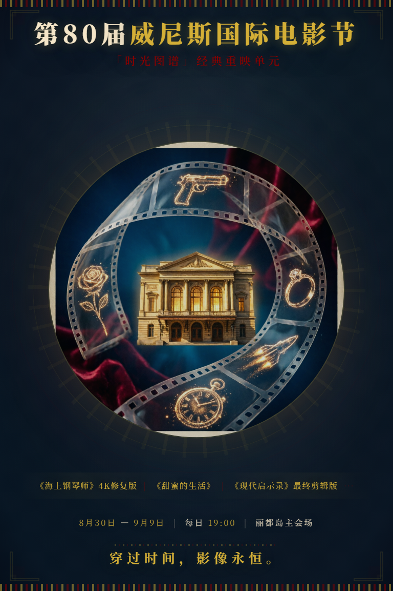
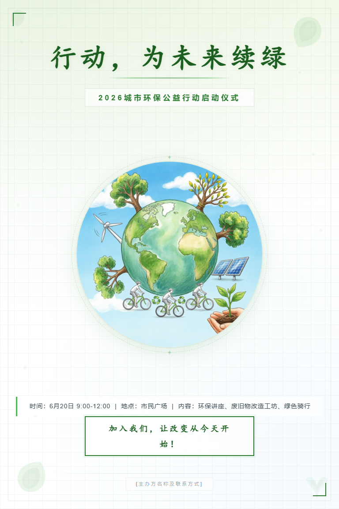
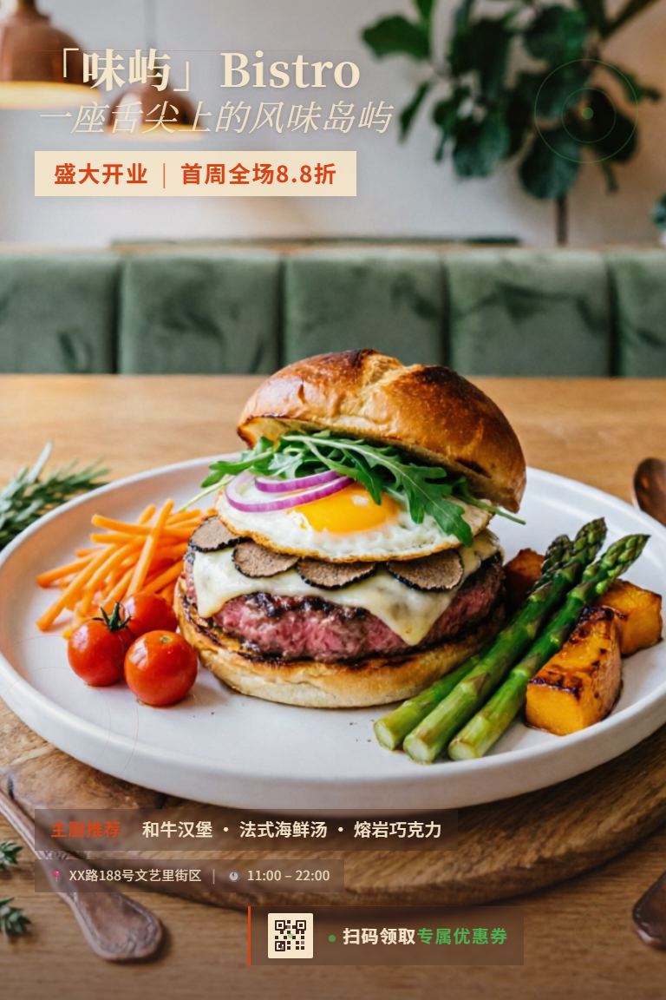

# PostAI

## 多 Agent 智能海报生成系统

计算机图形学的生成式 AI 实践：从自然语言需求出发，生成
可编辑 HTML/CSS 海报 与
PNG 成品。

  

    
Input

    
Prompt

  

  

    
Process

    
Agent Workflow

  

  

    
Output

    
HTML + PNG

  

<!--
40 秒。开场只讲定位：PostAI 不是一次性文生图，而是把生成式 AI 放进海报设计和浏览器渲染流程里。先给老师一个记忆点：可控生成、可编辑源码、可渲染输出。
-->

---

# 背景问题

## 为什么不能只靠一次文生图？

  

    <h3 class="text-red-200">单次图像生成</h3>
    <ul class="mt-4 text-lg leading-7 opacity-85">
      <li>文字和排版难以精确控制</li>
      <li>结果通常不可编辑</li>
      <li>失败后只能重新抽卡</li>
      <li>缺少明确质量检查点</li>
    </ul>
  

  

    <h3 class="text-sky-200">PostAI 的目标</h3>
    <ul class="mt-4 text-lg leading-7 opacity-85">
      <li>把海报创作拆成可观察步骤</li>
      <li>保留 HTML/CSS 编辑源文件</li>
      <li>通过 VLM 反馈进行迭代</li>
      <li>无模型时仍可 fallback 运行</li>
    </ul>
  

核心目标不是“一次生成最漂亮”，而是让海报生成过程可控、可调试、可继续修改。

<!--
55 秒。这里要把问题讲清楚：文生图可以好看，但它很难保证中文文字、版式、局部修改和工程可控性。PostAI 的目标是把海报创作变成可以观察和迭代的流程。
-->

---

# 核心思想与总流程

## 把“画一张海报”拆成设计流水线

  
Prompt

  
→

  
内容理解

  
→

  
艺术指导

  
→

  
HTML 布局

  
→

  
PNG 输出

  
VLM 评审

  
→

  
Router 决策

  
→

  
完成或迭代

  <pre class="text-[13px] leading-5"><code>GenerateRequest
  -> ContentExtractor
  -> IllustrationAgent
  -> StyleDirector
  -> SpatialLayoutPlanner
  -> HTMLPainter
  -> VLMCritic
  -> Router</code></pre>
  

    <h3>实现入口</h3>
    
核心编排在 <code class="text-[15px] break-all">GraphRunner</code>；API 提供同步生成、SSE 流式进度和已有 HTML refine。

  

<!--
65 秒。这里合并原来的“核心思想”和“系统总架构”。讲清楚 GraphRunner 是总导演，API 只是入口；每个 Agent 只做一个阶段，共享状态由 GraphState 承载。
-->

---

# 状态中心：GraphState

  

    <h3>输入与约束</h3>
    

      <code>user_prompt</code> 
      <code>canvas</code> 
      <code>target_score</code> 
      <code>max_iterations</code>
    

  

  

    <h3>中间表示</h3>
    

      <code>poster_brief</code> 
      <code>art_direction</code> 
      <code>generated_illustrations</code> 
      <code>layout_html</code>
    

  

  

    <h3>反馈与输出</h3>
    

      <code>render_result</code> 
      <code>feedback_history</code> 
      <code>vision_reasoning</code> 
      <code>warnings</code>
    

  

Typed state 的好处：Agent 间接口清晰，API 响应可验证，测试可以直接覆盖状态机行为。

<!--
45 秒。这一页保留原来的 GraphState 内容，但不要逐个字段展开。重点讲“状态中心”让多 Agent 不靠自由文本乱传，而是靠结构化状态协作。
-->

---

# ContentExtractor

## 从用户 prompt 到结构化海报 brief

  

    
输出新版 <code>PosterBriefV2</code>，再转换成兼容旧流程的 <code>ContentPlan</code>。

    
关键原则：不默认强塞标题、副标题、CTA 或主图；只保留服务海报意图的内容。

    
它更像“内容策划”，不是简单抽关键词。

  

  <pre class="text-[13px] leading-5"><code>{
  poster_intent,
  content_strategy,
  messages: [
    { id, role, content, presence }
  ],
  visual_subjects: [
    { id, role, description, avoid }
  ],
  must_not_do
}</code></pre>

<!--
55 秒。保留原来的 PosterBriefV2 / ContentPlan 关系。这里可以举例：如果 prompt 没给时间地点，系统不应该凭空编；如果不需要 CTA，就不硬塞按钮。
-->

---

# Style + Illustration

## 艺术指导与可选视觉资产

  

    <h3>StyleDirector</h3>
    <ul class="mt-4 text-lg leading-7 opacity-85">
      <li>生成 <code>ArtDirectionV2</code></li>
      <li>定义 poster language、颜色系统、字体策略</li>
      <li>给布局 Agent 一个具体视觉方向</li>
    </ul>
  

  

    <h3>IllustrationAgent</h3>
    <ul class="mt-4 text-lg leading-7 opacity-85">
      <li>从 <code>visual_subjects</code> 选择候选资产</li>
      <li>调用 OpenAI-compatible 图像生成接口</li>
      <li>失败只记录 warning，不阻塞主流程</li>
    </ul>
  

这一步把“视觉风格”和“视觉素材”分开，避免生成图像直接吞掉整个版式控制权。

<!--
55 秒。保留 StyleDirector 和 IllustrationAgent。强调一个负责风格方向，一个负责可选资产；即使图像生成失败，也不影响主流程继续生成海报。
-->

---

# SpatialLayoutPlanner

## 关键选择：让 Agent 直接写 HTML/CSS

  

    <h3>为什么是 HTML/CSS？</h3>
    <ul class="mt-4 text-lg leading-7 opacity-85">
      <li>支持字体、层级、网格、裁切、纹理</li>
      <li>可保存为可编辑源文件</li>
      <li>浏览器渲染确定性强，方便调试</li>
      <li>比自定义几何 schema 表达力更高</li>
    </ul>
  

  <pre class="text-[13px] leading-5"><code>&lt;div id="headline" data-role="headline"&gt;
  三國殺：謀定天下
&lt;/div&gt;

#key-visual {
  position: absolute;
  inset: 0;
  object-fit: cover;
}</code></pre>

布局 prompt 会注入 brief、art direction、参考图、生成插图和上一轮 VLM 反馈。

<!--
65 秒。这是项目和计算机图形学关联最强的页面之一：HTML/CSS 是二维图形场景描述，里面有画布、图层、裁切、颜色、文字和组合关系。
-->

---

# HTMLPainter

## 用 Playwright / Headless Chromium 渲染海报

  

    
<code>HTMLPainter</code> 调用 Playwright，把 HTML 设置到页面中，再按指定画布尺寸截图。

    
生成结果同时保存两份：可编辑 <code>.html</code> 和可展示 <code>.png</code>。

  

  

    <h3>工程细节</h3>
    <ul class="mt-4 text-lg leading-7 opacity-85">
      <li><code>apply_canvas_guard</code> 固定宽高</li>
      <li>避免响应式缩放造成空白截图</li>
      <li>本地 asset URL 转成可渲染资源</li>
      <li>捕获浏览器 console errors</li>
    </ul>
  

生成式 AI 负责设计决策，Chromium 渲染管线负责把 HTML/CSS 稳定栅格化为 PNG。

<!--
65 秒。强调 Playwright 不只是截图工具，它让 CSS 的字体、图层、混合、裁切最终变成真实像素输出。这里可以提 canvas guard 是为了解决 LLM 生成响应式页面导致截图异常的问题。
-->

---

# VLM Critic + Router

## 让系统看见自己的输出

  

    <h3>CritiqueResult</h3>
    <ul class="mt-4 text-lg leading-7 opacity-85">
      <li><code>score</code> 与 <code>passed</code></li>
      <li>视觉描述与推理摘要</li>
      <li>结构化问题 <code>structured_issues</code></li>
      <li>六维 rubric：身份、主题、构图、字体、可读性、工艺</li>
    </ul>
  

  

    <h3>Router</h3>
    <ul class="mt-4 text-lg leading-7 opacity-85">
      <li>读取 <code>revision_focus</code></li>
      <li>结合目标分数与迭代预算</li>
      <li>决定 final、layout、style、content 或 render</li>
      <li>分数停滞时提前停止</li>
    </ul>
  

这使系统从“生成一次”变成“渲染后自评，再决定下一步”。

<!--
65 秒。讲清楚闭环价值：不是低分就盲目重画，而是由 revision_focus 决定下一步回到 layout、style、content、render 还是 final。
-->

---

# API、可用性与测试

  

    <h3>主要接口</h3>
    <ul class="mt-4 text-[16px] leading-7 opacity-85">
      <li><code>POST /api/v1/generate</code></li>
      <li><code>POST /api/v1/generate/stream</code></li>
      <li><code>POST /api/v1/refine</code></li>
      <li><code>POST /api/v1/reference-images/upload</code></li>
      <li><code>GET /assets/{filename}</code></li>
    </ul>
  

  

    

      <h3>状态机与 API</h3>
      
同步生成、SSE、路由决策、迭代边界。

    

    

      <h3>渲染与资产</h3>
      
HTML 模板、canvas guard、PNG 尺寸、本地 asset。

    

    

      <h3>模型客户端</h3>
      
LLM/VLM 结构化解析、fallback、图像响应解析。

    

    

      <h3>Golden Prompts</h3>
      
展览、招聘、讲座、产品发布、音乐节等类型。

    

  

演示时即使远程模型不可用，fallback 仍能跑通流程，便于课堂展示和自动化测试。

<!--
65 秒。这里合并原来的 API 与实验测试页。不要逐条讲测试文件名，只讲覆盖的风险点：接口、状态机、渲染、模型客户端、fallback。
-->

---

# 生成样例

  

    
    
电影节海报

  

  

    
    
环保活动

  

  

    
    
新店开业

  

  

    
    
游戏推广

  

固定 768×1152 poster canvas；生成插图可作为 key visual；HTML 保留语义 ID；PNG 可展示，HTML 可继续 refine。

<!--
60 秒。这里只展示四张结果图，用样例证明系统可以覆盖不同主题。最后一句说明这些结果都来自同一套生成流程，并且保留 HTML/PNG 两类输出。
-->

---

# 总结

  

    <h2>实现</h2>
    <ul class="mt-5 text-xl leading-9 opacity-85">
      <li>多 Agent 可观测海报生成流程</li>
      <li>HTML/CSS 作为高表达力中间表示</li>
      <li>浏览器渲染与 VLM 评审闭环</li>
      <li>模型不可用时仍能 fallback 演示和测试</li>
    </ul>
  

  

    <h2>后续工作</h2>
    <ul class="mt-5 text-xl leading-9 opacity-85">
      <li>加入人类偏好评测</li>
      <li>OCR/readability 自动指标</li>
      <li>更强的视觉 regression benchmark</li>
      <li>更可靠的 learned refinement policy</li>
    </ul>
  

PostAI = controllable generation + editable source + iterative critique

<!--
60 秒。最后收束为两部分：已经完成的贡献，以及后续可以继续做的评测和优化。结束语强调 controllable generation、editable source、iterative critique 三个关键词。
-->
